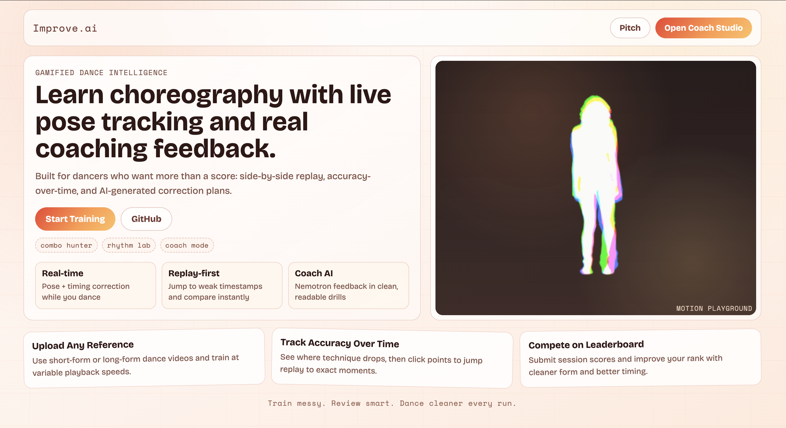

# Improve.ai

Improve.ai uses:
- A custom landing page at `/` (current design in `index.html` + `landing.css` + `landing.js`)
- The restored `dance-coach-ai-restored` app as the working dance studio at `/app.html` (React + Vite)
- A Python FastAPI backend with PoseScript-style analysis and Nemotron feedback

## Live links

- Vercel (frontend + backend): `https://monaco-nine-theta.vercel.app`
- GitHub Pages (frontend): `https://fcistud.github.io/dance-dance-instructor/`

## Practice screen



## Run locally (fast path)

Start everything (frontend + backend) in one command:

```bash
VITE_NEMOTRON_API_KEY='your_nvidia_key' npm run dev:local
```

Notes:
- This starts FastAPI at `http://127.0.0.1:8000`
- It starts Vite on the next available port (`5174`, `5175`, etc.)
- Open `/app.html` on that Vite URL for the practice app

## Local development (manual)

### Frontend

```bash
npm install
npm run dev
```

- Landing: `http://localhost:5174/`
- App: `http://localhost:5174/app.html`

### Backend (optional, recommended for AI feedback)

```bash
cd backend
python -m venv .venv
source .venv/bin/activate
pip install -r requirements.txt
uvicorn server:app --reload --port 8000
```

The Vite dev server proxies these routes to the backend:
- `/api/feedback`
- `/api/describe`
- `/api/correct`
- `/api/health`

## Deployment

## Run online

### Vercel (frontend + backend)

Production URL:
- `https://monaco-nine-theta.vercel.app`

Health check:
- `https://monaco-nine-theta.vercel.app/api/health`

If deploying again from local:
```bash
npx vercel deploy --prod -y --env VITE_NEMOTRON_API_KEY='your_nvidia_key' --env ALLOWED_ORIGINS='https://monaco-nine-theta.vercel.app,https://fcistud.github.io,http://localhost:5174,http://localhost:5173,http://localhost:3000'
```

### GitHub Pages (frontend only)

Pages URL:
- `https://fcistud.github.io/dance-dance-instructor/`

Workflow: `.github/workflows/deploy.yml`.

Set repository secret:
- `VITE_API_BASE_URL` pointing to deployed backend URL (`https://monaco-nine-theta.vercel.app`)

## GitHub Secrets only setup (recommended)

This repo supports a secrets-only setup with no manual URL entry in the UI:

1. Add these repository secrets:
   - `VERCEL_TOKEN`
   - `VERCEL_ORG_ID`
   - `VERCEL_PROJECT_ID`
   - `VITE_NEMOTRON_API_KEY`
   - `VITE_API_BASE_URL` (set this to your stable Vercel production URL, e.g. `https://your-project.vercel.app`)
   - Optional: `ALLOWED_ORIGINS` (comma-separated CORS origins)
2. Run workflow: `.github/workflows/deploy-backend-vercel.yml`
3. Push to `main` (or rerun) so `.github/workflows/deploy.yml` rebuilds Pages with `VITE_API_BASE_URL` from secrets.

## Notes

- Backend exposes both prefixed and non-prefixed routes (`/feedback` and `/api/feedback`) for compatibility across hosts.
- PoseScript-style feedback generation is implemented in `backend/pose_descriptor.py` and combined with Nemotron in `backend/server.py`.
